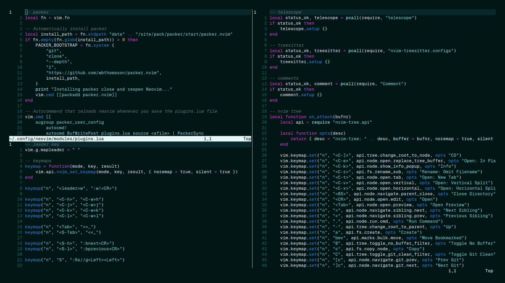

# Marine Dark Theme

Enhance your coding experience with **Marine Dark**, a soothing colorscheme that's easy on eyes, created by The [ProDeSquare](https://prodesquare.com)



### Installation Guide

With Packer

```lua
use 'MarineDark/marine-dark.nvim'
```

### Usage

```lua
require('marine-dark').setup()
```
